## Xeno Roblox Executor
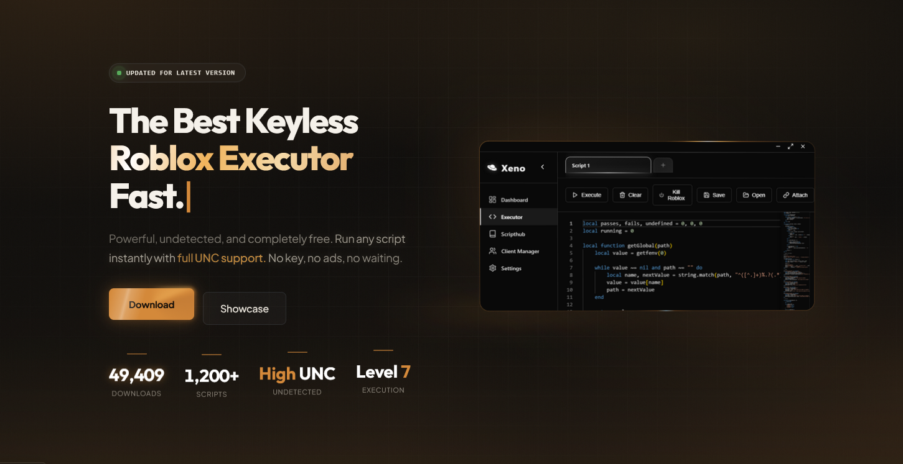

AI Slop olduğu bariz olan bir site. Showcase butonuna bastığımda beni bir youtube videosuna yönlendirdi ve malware'yi oluşturan kişinin/grubun slav kökenli olduğunu düşünmeye başladım

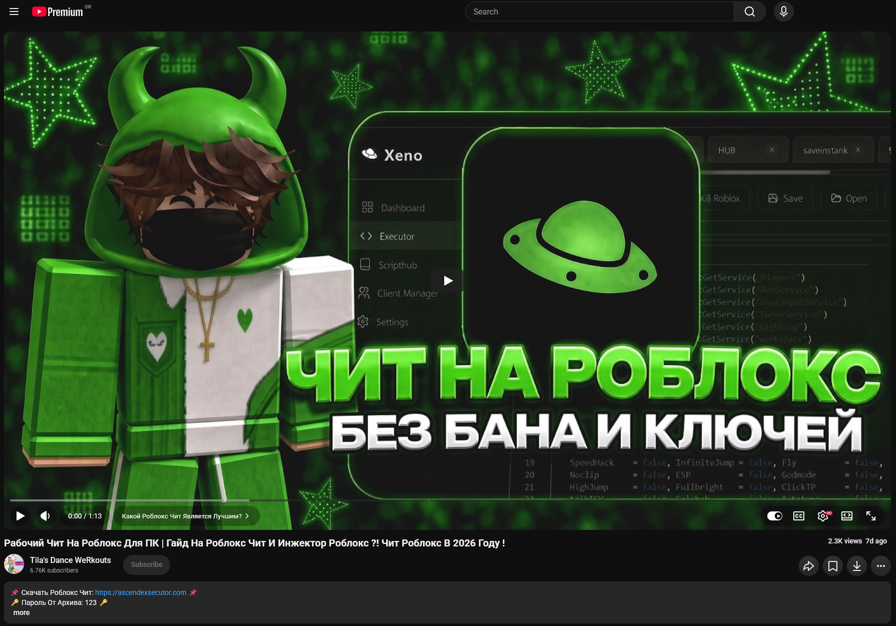

Dosyayı indirmeye çalıştığımda bana kurulum talimatlarını gösterdi. İlk önce zip şifresini girip dosyayı çıkarmamızı istiyor ve ardından Anti Virüs programlarını geçici olarak kapatmamızı istiyor.

> Çoğu zaman zip dosyasına şifre koymak, zip dosyasının anti virüs taramalarından kaçmasını sağlayabilir.
{: .prompt-warning }

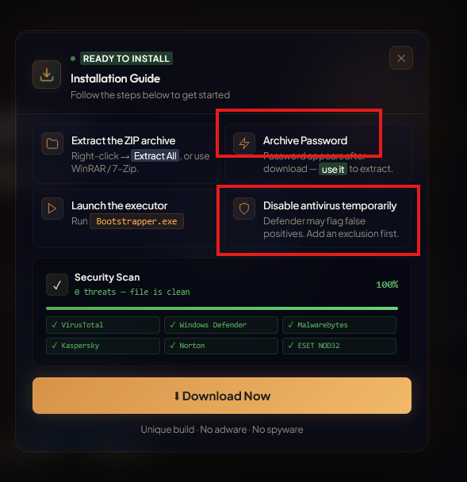

tria.ge'ye dosyayı yükleyip analiz ettiğimde **salatstealer** familyasından bir stealer olduğunu fark ettim

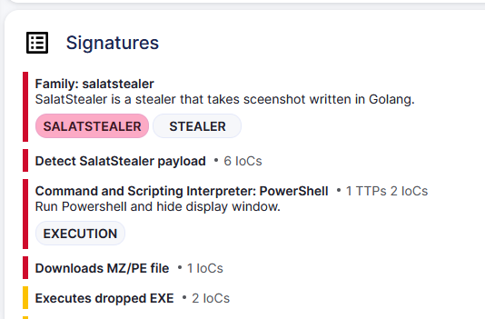

## SalatStealer'ın Elde Ettiği Bilgiler
- Web Tarayıcı Verileri
    - Chromium ve Gecko tabanlı tarayıcıların kullanıcı adları, çerez bilgileri, otomatik doldurma ve tarayıcı geçmişi

- Ekran Görüntüsü
    - Mevcut ekranınızın anlık ekran görüntüsünü

- Kripto Para Cüzdanları
    - Tarayıcı eklentisi olan cüzdanlar (MetaMask, Phantom, TronLink, CoinBase vb.)
    - Masaüstü cüzdan uygulamaları ve `wallet.dat` dosyaları (Exodus, Atomic, Electrum vb.)

- İletişim ve Oyun Oturumları
    - Discord tokenleri
    - `tdada` klasörü (Telegram)
    - `ssfn` dosyaları ve giriş oturum konfigürasyonları (Steam)

- Sistem ve Ağ Bilgileri
    - İşletim sistemi sürümü, kullanıcı adı, bilgisayar adı
    - IP adresi, coğrafi konum ve sistem dil ayarları
    - Donanım bilgileri (CPU, GPU, RAM) ve çalışan process listesi

- VPN ve FTP İstemcileri
    - FileZilla, WinSCP gibi FTP istemcilerindeki kayıtlı sunucu bilgileri
    - NordVPN, OpenVPN gibi kayıtlı profil ve kimlik bilgileri

Toplanan tüm bu veriler genellikle bir `.zip` veya klasörler altında toplanarak şifrelenir ve saldırgana aktarılır.

## Analiz

`193.221.200.26` Adresinden `sib.exe` adında bir dosya indiriliyor sisteme.

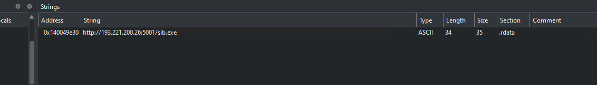

### WhoIs Çıktısı

IP adresi `Partner Hosting LTD`'e ait olduğunu işaret ediyor.

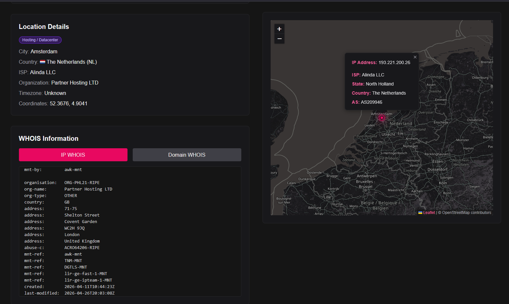

**Partner Hosting** bulletproof özelliği ile bilinen bir hosting firmasıdır. internete **Partner Hosting** arattığınızda AbuseIPDB sonuçlarını çok fazla gördüm.

### Active Enumeration

`193.221.200.26:5001` adresine gittiğimde beni çok fazla **.EXE** dosyası karşıladı. Sitenin dili rusça olduğu için stealer sahibinin slav kökenli olduğunu çıkardım. 

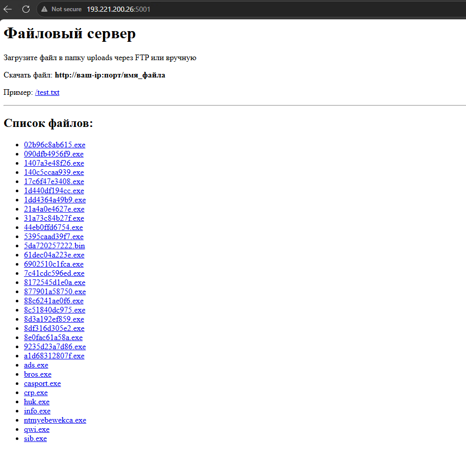

`sib.exe` dosyasını tria.ge'de analiz ettiğimde ana malware'imizi buldum. UPX paketlenmiş olduğunu görüyorum

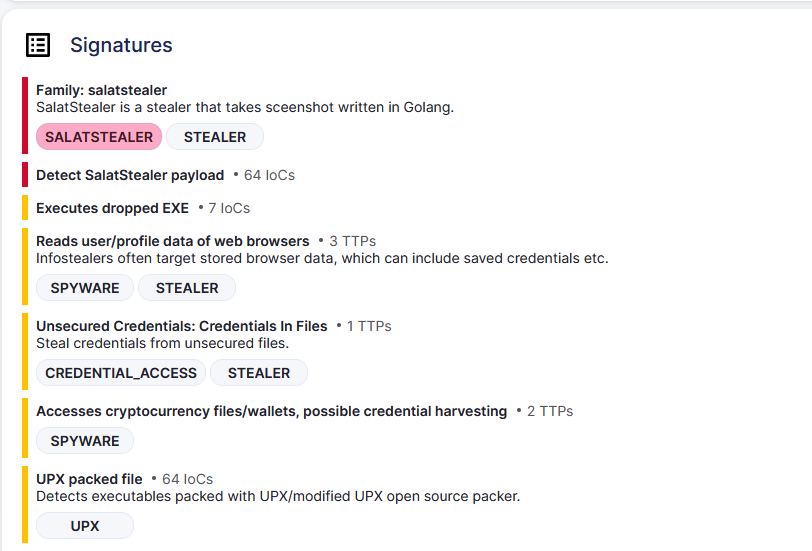

`sib.exe`'yi UPX kullanarak unpacked ettim.

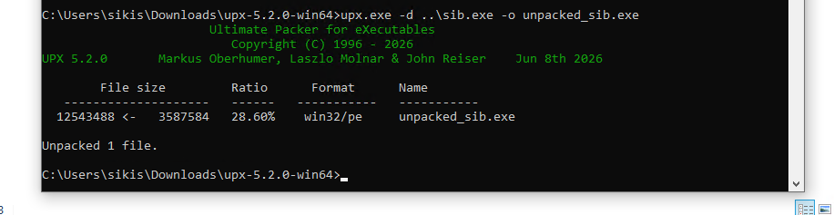

### Son Analizler

sib.exe'yi unpacked ettikten sonra unpacked edilen dosyayı Cutter ile inceledim ve malware olduğunu doğrulayan kanıtlar buldum

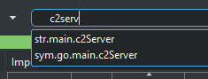
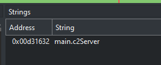
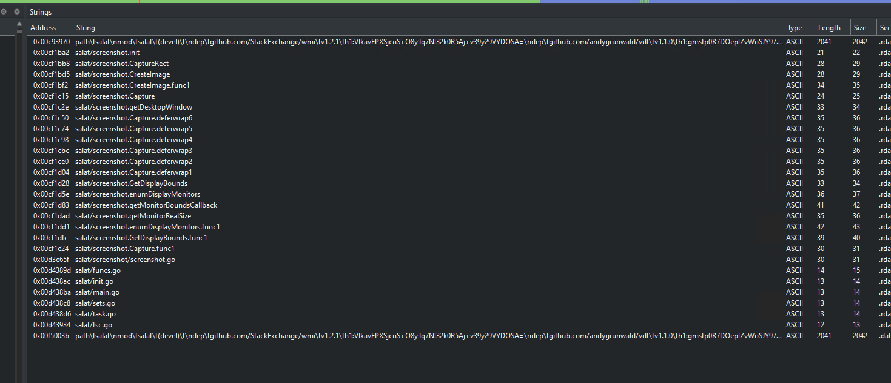

## Ne öğrendik

Kaynağını bilmediğiniz, bir sürü şey vaad eden ve karşılığında bir şey istemeyen programlara güvenmeyin.
TAKLAYA GELMEYİN.

## Bağış Adresleri

`BTC: bc1qkxxy62ys08kelfaunm0txqg2vl02dqxa2pr97t`

`ETH: 0xE2F2684F24C532AC22Af1C95AaB058eD67980612`

`LTC: LWh5trXQ9wVAFkpyJiXAFyCRL8vRevVc1i`
